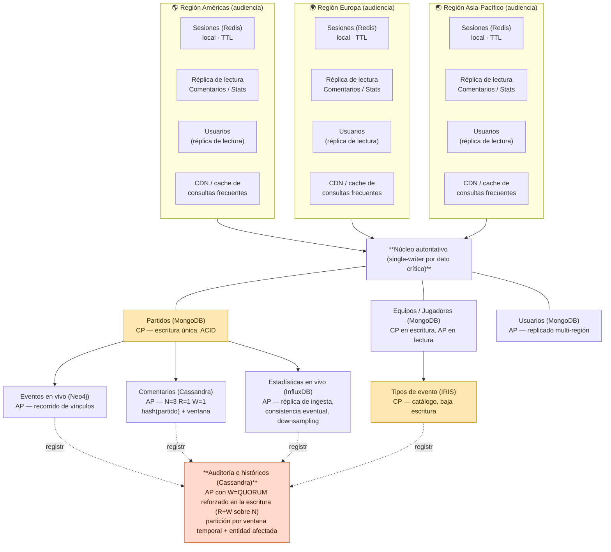

# 🏗️ Hito 3 — Arquitectura Distribuida del Fixture 2030

**Plataforma Fixture Mundial 2030 — Ingeniería de Datos II**

**Alumnos:** Santiago Pazos, Joaquín Núñez y Valentina Frisoli

> Este documento transcribe el contenido del Hito 3 (arquitectura distribuida) y queda como contexto persistente del proyecto en el repositorio. Incluye la corrección pedida por la corrección del hito: los parámetros **N/R/W** se expresan de forma explícita únicamente donde la tecnología los expone como parámetro nativo por operación (**Cassandra**); en el resto de los modelos (InfluxDB, MongoDB, Redis) réplica y consistencia se describen conceptualmente.

---

## 📋 Resumen de decisiones previas

En el Hito 2 se asignó cada necesidad de datos a uno de los seis modelos NoSQL. La tabla siguiente recupera esa asignación y agrega qué decisión de diseño distribuido quedaba pendiente para este hito.

| Necesidad (Hito 1/2) | Modelo elegido | Qué quedaba pendiente en Hito 3 |
|---|---|---|
| N1 Equipos y jugadores | Documental (MongoDB) | Topología de réplicas y alcance de la consistencia en escritura |
| N2 Partidos | Documental (MongoDB) | Decisión frágil (margen 0,20). Validar con CAP, no solo con la matriz |
| N3 Eventos | Grafo (Neo4j) | Consistencia de las relaciones frente a escrituras concurrentes |
| N4 Usuarios | Documental (MongoDB) | Decisión frágil (margen 0,20). Validar con CAP y topología multi-región |
| N5 Sesiones | Clave-valor (Redis) | Alcance de la réplica por región y parámetros N, R, W |
| N6 Comentarios | Columnar (Cassandra) | Criterio de partición y parámetros N, R, W para el pico |
| N7 Estadísticas en vivo | Series temporales (InfluxDB) | Partición por período y estrategia de downsampling |
| N8 Entidades complejas (tipos de evento) | Objetos (IRIS) | Alcance de la consistencia frente a Eventos (N3) |
| N9 Auditoría e históricos | Columnar (Cassandra) | Contradicción a resolver: BASE vs. "no se puede perder" |

**Sobre el margen de las decisiones frágiles.** El control de margen del Hito 2 fue correcto en señalar N2 y N4: un resultado que depende de 0,20 puntos sobre 5 no es una base sólida por sí sola. Lo que agrega este hito no es una nueva puntuación, sino un criterio de naturaleza distinta — qué exige el teorema CAP para cada necesidad — que puede confirmar la elección por una razón independiente del puntaje, o señalar que conviene revisarla (ver validaciones de N2 y N4 más abajo).

**Sobre la contradicción de Auditoría.** En el Hito 2 conviven dos cosas que no encajan del todo: que un registro de auditoría perdido invalida el propósito del subsistema, y que se elige igual un modelo orientado a BASE. La herramienta para resolverlo sin cambiar de modelo son los parámetros N, R y W: permiten configurar, dentro de un motor que en general prioriza disponibilidad, un comportamiento de escritura con la garantía de durabilidad que este dato necesita (desarrollado más abajo).

---

## 🔀 Análisis CAP y modelos de consistencia

Para cada subsistema priorizado se define qué propiedad de CAP se sacrifica durante una partición de red, qué modelo de consistencia corresponde y qué impacto tendría una lectura desactualizada. El sacrificio nunca es "ninguno": en un sistema realmente distribuido, si la red se particiona hay que elegir entre responder con un dato posiblemente viejo o no responder.

| Subsistema | Prioridad CAP | Se sacrifica | Modelo de consistencia | Impacto de una lectura vieja |
|---|---|---|---|---|
| Partidos (N2) | CP | Disponibilidad | Fuerte (linealizable) en el cierre | Inaceptable: dos marcadores oficiales distintos |
| Equipos y jugadores (N1) | CP en escritura / AP en lectura | Disponibilidad de escritura | Sesión en lectura, fuerte en la confirmación del cambio | Tolerable: se ve el dato anterior unos segundos |
| Eventos en vivo (N3) | AP | Consistencia | Eventual con orden causal (gol antes que asistencia) | Tolerable: el evento aparece con demora, no al revés. Al restablecerse la comunicación, los eventos se propagan y reconcilian respetando el orden causal |
| Usuarios (N4) | AP | Consistencia | Eventual, con consistencia de sesión para el propio usuario | Tolerable entre usuarios; no tolerable para uno mismo |
| Sesiones (N5) | AP | Consistencia | Eventual, ventana de segundos | Tolerable: en el peor caso se repite un login |
| Comentarios (N6) | AP | Consistencia | Eventual | Tolerable: un comentario tarda en aparecer para otros |
| Estadísticas en vivo (N7) | AP | Consistencia | Eventual, con orden monótono por partido | Tolerable: la posesión del minuto 40 llega con la del 41 |
| Tipos de evento (N8) | CP | Disponibilidad | Fuerte sobre el catálogo de tipos | Inaceptable: dos definiciones distintas de "Gol" a la vez |
| Auditoría (N9) | AP con escritura reforzada | Consistencia de lectura (no la de escritura) | Eventual en lectura; escritura con quórum (ver sección de Replicación) | Tolerable en lectura; inaceptable perder la escritura |

Tres pares comparten el mismo patrón CAP y conviene explicarlo una sola vez:

- **Partidos y Tipos de evento son CP por la misma razón**: los dos son catálogos donde dos versiones simultáneas del mismo hecho —un marcador o la definición de un tipo de evento— generan una contradicción visible para el usuario, no solo un dato viejo.
- **Eventos es AP con consistencia causal**: no garantiza sincronización global, pero sí que una asistencia nunca aparece antes que su gol.
- **Comentarios, Estadísticas y Sesiones son AP con eventual pura** porque su dato es aditivo o transitorio sin dependencia entre instancias.
- La única entidad que no encaja en ninguno de los dos patrones es **Auditoría**, y por eso se trata aparte.

### N2 · Partidos — validación independiente de la decisión frágil

La matriz del Hito 2 mostró Documental (MongoDB) por 0,20 sobre Objetos (IRIS). El análisis CAP no vuelve a puntuar: pregunta qué necesita el requisito en sí. La propiedad que no se puede resignar es la consistencia — se prefiere que el cierre falle o quede en espera antes que mostrar dos resultados oficiales distintos. Ese requisito es el mismo para cualquiera de los dos modelos, así que no rompe el empate por sí solo. Lo que sí agrega una razón nueva es la **topología**: un partido no necesita escribirse desde más de una región a la vez —el cierre lo confirma un único árbitro digital, no una audiencia distribuida—, así que el diseño CP se resuelve con un único nodo autoritativo por partido y replicación síncrona hacia el resto, sin pagar el costo de un consenso multi-región en cada escritura. Esa topología es igual de viable en IRIS que en MongoDB. Se sostiene la decisión del Hito 2 no porque CAP la desempate, sino porque CAP confirma que el 0,20 de diferencia no compromete nada crítico.

### N4 · Usuarios — validación independiente de la decisión frágil

Acá el margen de 0,20 favoreció a Documental (MongoDB) sobre Columnar (Cassandra). El análisis CAP muestra que Usuarios es un caso AP: el perfil se lee en cada request desde seis países y tolera propagarse con demora, así que sacrificar disponibilidad para mantener consistencia inmediata sería resignar justamente lo que el escenario pide (100 ms para el 95% de las consultas). Los dos modelos pueden operar en modo AP con consistencia eventual, así que otra vez CAP no desempata por sí solo. La razón que sí agrega peso a Documental es de **topología, no de puntaje**: Equipos, Jugadores y Partidos ya requieren un núcleo con escritura coordinada en el mismo motor documental, y agregar Usuarios ahí evita un tercer sistema replicado de forma independiente, con su propio mecanismo de reconciliación. Se sostiene Documental, pero se identifica la condición que la haría caer: si el padrón de usuarios creciera muy por encima de lo estimado, la escalabilidad de escritura de un modelo columnar volvería a ser competitiva (pregunta abierta, ver más abajo).

### N9 · Auditoría — resolución de la contradicción

En el Hito 2 se eligió un modelo columnar orientado a AP y, en la misma sección, se reconoció que perder un registro invalida el propósito del subsistema. Las dos afirmaciones son incompatibles si se entienden como una propiedad única del sistema. Dejan de serlo si se separan lectura y escritura, que es lo que permiten los parámetros N, R y W. Auditoría puede seguir siendo AP para la lectura, mientras la escritura se configura con una combinación donde el número de réplicas que deben confirmar sea suficiente para que ninguna escritura confirmada se pierda, incluso si el sistema en su conjunto no ofrece consistencia fuerte para el resto de las operaciones. El principio: la contradicción no se resuelve eligiendo entre AP y "no se puede perder", se resuelve reconociendo que esos dos requisitos aplican a operaciones distintas del mismo subsistema (el detalle numérico está en la sección siguiente).

---

## 🔁 Replicación, particionamiento y quórum

Para cada subsistema se define el criterio de partición, la topología de réplica y, **donde la tecnología lo admite como parámetro configurable por operación**, los valores de N, R y W.

> **Sobre el uso de N/R/W en esta sección.** No todos los modelos exponen réplica y consistencia de la misma manera. **Cassandra** expone N, R y W directamente como parámetro por operación, y es el modelo de quórum que se trabajó en profundidad en Clase 3 — por eso Comentarios (N6) y Auditoría (N9) sí llevan valores explícitos de N/R/W. El resto de los modelos logra el mismo efecto (cuántas copias deben confirmar antes de responder) con mecanismos propios: MongoDB con factor de réplica y *write concern*/*read preference* sobre su replica set, Redis con réplicas y expiración (TTL) sin quórum de lectura, e **InfluxDB con factor de réplica y consistencia eventual entre nodos de ingesta, sin un parámetro de quórum por escritura equivalente al de Cassandra**. Por eso, para Estadísticas en vivo (N7, InfluxDB) la réplica y la consistencia se describen a continuación de forma conceptual, y no con la notación N/R/W explícita.

| Subsistema | Criterio de partición | Topología de réplica | Réplica y consistencia | Riesgo principal |
|---|---|---|---|---|
| Partidos | Ninguno — volumen bajo, un registro por partido | Un nodo autoritativo por partido, síncrona hacia 2 réplicas | N=3, escritura confirma con mayoría (2 de 3) | Ninguna partición por hotspot; riesgo es de coordinación en el cierre |
| Equipos y jugadores | Ninguno — catálogo de 64 equipos | Réplica por región para lectura, escritura en nodo primario | N=3, lectura local, escritura confirma en el primario | Ventana de segundos con datos desactualizados tras un cambio |
| Eventos en vivo | Por partido; los eventos de un mismo partido conviven | Réplica multi-región asíncrona | Confirmación de escritura local, propagación en segundo plano | Recorrido de un evento reciente en una región que aún no lo recibió |
| Usuarios | Por identificador de usuario (distribución uniforme) | Réplica multi-región, un primario por usuario según su región de alta | Lectura local mayoritaria, escritura confirma en el primario | Usuario que viaja y escribe desde una región distinta a la de su primario |
| Sesiones | Por identificador de sesión, sin replicar entre regiones | Local a la región donde se generó, sin réplica cross-región | Vigencia automática (TTL), sin quórum | Pérdida de la sesión si cae el nodo local; el usuario reautentica |
| Comentarios | Compuesta: identificador de partido + ventana temporal | Distribuida entre varios nodos por región de origen del pico | **N=3, R=1, W=1** (prioriza velocidad, tolera inconsistencia breve) | Concentración de escritura en la ventana del minuto 90 de un partido popular |
| **Estadísticas en vivo** | Por partido + intervalo temporal | Réplica de bajo factor dentro de la región de ingesta, agregados propagados luego | **Réplica conceptual (no N/R/W explícito):** escritura confirma rápido dentro de la región de ingesta para priorizar disponibilidad y throughput; propagación entre réplicas es eventual; el ajuste fino de consistencia se maneja vía downsampling y política de retención, no vía quórum de lectura/escritura | Pérdida de puntos individuales del segundo, aceptable por el downsampling |
| Tipos de evento | Ninguno — catálogo acotado y estable | Réplica síncrona de baja frecuencia | N=3, escritura confirma con mayoría | Cambios de tipo poco frecuentes; el riesgo es de coordinación con Eventos |
| Auditoría | Compuesta: ventana temporal + entidad afectada | Distribuida entre nodos, sin restricción geográfica estricta | **N=3, R=1, W=QUORUM** (2 de 3) en la escritura | Retraso o rechazo de una escritura si no hay quórum disponible |

**Sobre el quórum de Auditoría.** La combinación N=3, R=1, W=QUORUM está elegida a propósito y permite reforzar la durabilidad de las escrituras. Con W=QUORUM, dos de las tres réplicas deben confirmar antes de aceptar la escritura como exitosa. En este caso R=1 y W=2, por lo que R+W=N: alcanza para sostener la durabilidad de la escritura, pero no garantiza que una lectura vea siempre el dato más reciente —eso exigiría R+W>N—, algo que acá no hace falta porque el objetivo es no perder el registro, no leerlo actualizado al instante. La lectura puede seguir siendo rápida al consultar una sola réplica, aunque puede existir un retraso temporal en la propagación hacia las demás.

**Sobre el hotspot de Comentarios.** Particionar únicamente por identificador de partido concentraría el millón de comentarios de la final en una sola porción del sistema, mientras el resto permanece ocioso. Combinar el identificador del partido con una ventana temporal reparte esa carga entre varias porciones sin perder la localidad por partido, que es el acceso dominante.

**Sobre sesiones sin réplica cross-región.** Es una decisión deliberada, no una omisión: el Hito 2 estableció que perder una sesión ante una falla es aceptable, porque el usuario vuelve a autenticarse. Replicar sesiones entre regiones agregaría costo de coordinación para un dato cuya pérdida ya se asume como tolerable.

---

## 📈 Escalabilidad, fallos y métricas

### Plan de escalabilidad

El escenario exige sostener entre 2 y 3 millones de usuarios simultáneos y picos de más de 100.000 solicitudes por segundo, con crecimiento concentrado en las horas de partidos de alta audiencia. Eso descarta el escalamiento vertical como estrategia principal para cualquier subsistema de audiencia. El escalamiento horizontal es la estrategia de base para Comentarios, Eventos, Estadísticas, Sesiones y Auditoría. Partidos, Equipos/Jugadores y Tipos de evento son la excepción: su volumen es bajo y fijo, así que no necesitan escalar y el diseño prioriza la consistencia por sobre la capacidad de crecer.

| Subsistema | Cuello de botella previsible | Respuesta de escalamiento |
|---|---|---|
| Sesiones | Volumen de escritura de login/logout en el arranque de un partido popular | Horizontal, agregando nodos por región antes del horario de partidos de alta audiencia |
| Comentarios | Escritura concentrada en la ventana de goles o del final del partido | Horizontal, con la partición compuesta ya prevista repartiendo el pico entre nodos |
| Estadísticas en vivo | Ingesta sostenida de millones de puntos por partido en simultáneo con otros partidos | Horizontal por partido; cada partido ingiere en una porción distinta del clúster |
| Auditoría | Volumen acumulado a lo largo de todo el torneo, no solo en picos | Horizontal continuo, con el particionamiento por ventana temporal facilitando agregar capacidad sin reorganizar el histórico completo |
| Usuarios | Lectura en cada request desde seis países | Horizontal por región, con réplicas de lectura locales; la escritura no es el cuello de botella |
| Eventos | Ninguno significativo: volumen bajo y acotado por la cantidad de partidos | Se prioriza el escalamiento horizontal de las réplicas de lectura y la distribución de las consultas entre regiones |

### Escenarios de fallo y resiliencia

| Escenario | Subsistemas afectados | Respuesta esperada |
|---|---|---|
| Caída del nodo primario de un partido durante el cierre | Partidos | El cierre queda en espera hasta que se elige un nuevo nodo autoritativo por mayoría; no se confirma un resultado sin esa elección |
| Aislamiento temporal de una región completa (partición de red) | Usuarios, Sesiones, Comentarios, Estadísticas, Eventos | Cada región sigue respondiendo con sus réplicas y su primario local donde exista; lo que no puede resolver localmente queda en cola y se reconcilia al restablecerse la conexión. Se prioriza A sobre C |
| Pico de escritura muy superior al estimado en un partido inesperadamente masivo | Comentarios | La partición compuesta limita el impacto a las porciones del pico; si aun así se satura, W=1 permite seguir aceptando escrituras a costa de una consistencia de lectura más floja, no de rechazar comentarios |
| Falla de una réplica durante la escritura de un registro de auditoría | Auditoría | Con N=3 y W=QUORUM, la escritura se sostiene mientras al menos dos de las tres réplicas respondan; solo se pierde disponibilidad de escritura si fallan dos réplicas a la vez |

### Métricas propuestas

Las métricas se definen por lo que cada subsistema prioriza según su análisis CAP: los subsistemas CP necesitan métricas de tiempo de coordinación, los AP necesitan métricas de retraso de propagación.

| Métrica | Qué mide | Dónde importa más |
|---|---|---|
| Latencia de confirmación de escritura (P95, P99) | Tiempo entre la solicitud y la confirmación al cliente | Partidos, Tipos de evento (CP): un aumento indica riesgo de incumplir el cierre a tiempo |
| Retraso de propagación (replication lag) | Diferencia de tiempo entre la escritura primaria y su visibilidad en cada réplica | Usuarios, Eventos, Comentarios, Estadísticas (AP) |
| Tasa de escrituras rechazadas por falta de quórum | Proporción de escrituras de auditoría que no alcanzan W=QUORUM | Auditoría: valida en producción que la garantía de durabilidad se cumple |
| Throughput por partición (operaciones por segundo) | Carga que recibe cada porción del sistema en un pico | Comentarios, Estadísticas: detecta si el criterio de partición sigue repartiendo bien la carga |
| Disponibilidad efectiva (%) por región | Proporción de solicitudes respondidas dentro del objetivo de 100 ms | Sesiones, Usuarios: valida el objetivo de 99,99% del escenario, desagregado por región |
| Cantidad de réplicas activas por partición | Estado de salud de cada conjunto de réplicas | Todos los subsistemas replicados: anticipa el escenario de "falla una réplica más" antes de que ocurra |

---

## 📐 Diagrama de arquitectura

**Fixture 2030 — Arquitectura distribuida conceptual.** Regiones de audiencia, subsistemas por necesidad y rol de consistencia (C) / disponibilidad (A).

- Línea sólida: escritura confirmada / propagación autoritativa.
- Línea fina: lectura / propagación asíncrona.
- Línea punteada: registro de auditoría (todas las escrituras).

---

## 🧩 Supuestos que sostiene este diseño

- El cierre de un partido lo confirma un proceso único (un "árbitro digital"), no una operación iniciada de forma concurrente desde varias regiones. Si el escenario cambiara —por ejemplo, jueces de línea distribuidos que confirman en paralelo— el diseño CP de Partidos necesitaría revisarse.
- El padrón de usuarios crece de forma sostenida. Es el mismo supuesto que quedó abierto en el Hito 2 para N4, y este hito lo hereda sin validarlo.
- La ventana de comentarios que reparte la partición compuesta alcanza para distribuir el pico de un partido de máxima audiencia. No se midió ese pico contra datos reales de un evento comparable.

## ❓ Preguntas a validar durante los próximos hitos

1. ¿Cuántas réplicas concretas conviene usar para Auditoría — N=3 alcanza, o el volumen acumulado (260 TB) exige un N mayor para no comprometer W=QUORUM cuando una réplica esté en mantenimiento?
2. ¿Qué mecanismo reconcilia Partidos con Eventos si la propagación desde el núcleo autoritativo hacia la capa de Eventos falla? El Hito 1 y 2 identificaron el problema; este hito ubica dónde ocurre geográficamente, pero no resuelve el mecanismo de reintento.
3. La condición que haría caer la decisión de N4 Usuarios (padrón muy por encima de lo estimado) ¿a partir de qué cifra concreta correspondería reevaluarla? ¿La réplica local de Usuarios en cada región alcanza para el objetivo de 100 ms, o hace falta un primario por región además de la réplica de lectura?
4. ¿Qué pasa con una sesión activa cuando el usuario cambia de región durante un partido (por ejemplo, viajando)? El diseño actual no contempla ese caso y lo deja para el hito de implementación.
5. ¿Los valores de N, R y W propuestos para Comentarios y Auditoría (Cassandra) siguen siendo razonables si dos partidos de alta audiencia se superponen en el calendario?
