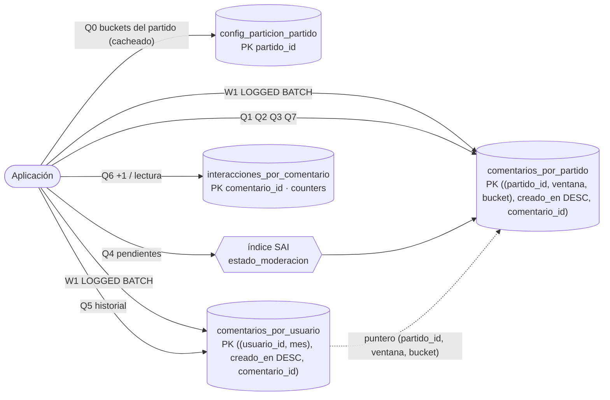

# Modelo tabular — Hito 6 · Módulo de Comentarios (Cassandra)

**Ingeniería de Datos II · Grupo 2** — Santiago Pazos, Valentina Frisoli, Joaquín Núñez

El esquema ejecutable está en [`scripts/esquema.cql`](../scripts/esquema.cql). Este documento describe cada estructura y la consulta que la justifica ([`patrones_de_acceso.md`](./patrones_de_acceso.md)).

---

## 1. Keyspace

```sql
CREATE KEYSPACE IF NOT EXISTS fixture2030_comentarios
  WITH replication = {'class': 'NetworkTopologyStrategy', 'datacenter1': 1};
```

| | Laboratorio (este hito) | Producción (Hito 3) |
|---|---|---|
| Nodos | 1 contenedor | Varios nodos por región |
| Estrategia | `NetworkTopologyStrategy` | `NetworkTopologyStrategy` |
| Factor de réplica | `datacenter1: 1` | `americas: 3, europa: 3, africa: 3` |
| Escritura de comentarios | `CONSISTENCY ONE` | `ONE` → **N=3, R=1, W=1** (R+W ≤ N: eventual) |
| Qué pasa si cae un nodo | Se cae todo el módulo | Las otras 2 réplicas de la región siguen respondiendo |
| Partición de red entre regiones | No aplica | Cada región sigue aceptando comentarios (AP) y converge después |

**Por qué `NetworkTopologyStrategy` con un solo nodo.** Porque es la estrategia de producción que pide el Hito 3 (réplica por región). Con `SimpleStrategy` el laboratorio funcionaría igual, pero el keyspace no se podría llevar a multi-región sin redefinirlo. El factor 1 es honesto: con un solo nodo no hay réplicas, y **este ambiente no es de alta disponibilidad**.

---

## 2. Tablas

### 2.1 `comentarios_por_partido` — tabla principal (Q1, Q2, Q3, Q4, Q7)

```
PRIMARY KEY ((partido_id, ventana, bucket), creado_en, comentario_id)
CLUSTERING ORDER BY (creado_en DESC, comentario_id ASC)
```

| Columna | Tipo | Rol | Descripción (RF6) |
|---|---|---|---|
| `partido_id` | text | **Partición** | Contexto deportivo. = `Partido.partidoId` del Hito 5 |
| `ventana` | timestamp | **Partición** | Piso de `creado_en` a múltiplo de 10 minutos |
| `bucket` | int | **Partición** | `crc32(comentario_id) % buckets`; 0 si el partido tiene 1 bucket |
| `creado_en` | timestamp | **Clustering DESC** | Instante de creación (UTC, milisegundos) |
| `comentario_id` | text | **Clustering ASC** | Identificador: `'{partido_id}-C{secuencia}'` |
| `usuario_id` | text | | Autor. Mismo identificador que el padrón de Usuarios (N4) |
| `alias_usuario` | text | | Autor, duplicado para mostrar sin consultar N4 |
| `hinchada` | text | | Contexto: `LOCAL` / `VISITANTE` / `NEUTRAL` |
| `minuto_partido` | int | | Contexto: minuto de juego |
| `responde_a` | text | | Contexto: `comentario_id` al que responde, o null |
| `contenido` | text | | Texto del comentario |
| `idioma` | text | | `es` / `pt` / `en` / `fr` / `ar` |
| `editado` | boolean | | El autor lo modificó |
| `estado_moderacion` | text | | `PUBLICADO` / `PENDIENTE` / `OCULTO` / `ELIMINADO` (indexado con SAI) |
| `motivo_moderacion` | text | | Motivo de la acción de moderación |
| `moderado_por` | text | | Moderador que actuó |
| `moderado_en` | timestamp | | Instante de la acción |

**Clave de partición `(partido_id, ventana, bucket)`.** Cada componente resuelve un problema distinto:

| Componente | Problema que resuelve | Sin él |
|---|---|---|
| `partido_id` | Localidad: lo que se lee junto vive junto | Leer los comentarios de un partido tocaría todo el clúster |
| `ventana` | La partición no crece durante todo el partido: se "cierra" cada 10 minutos | Una partición de 1.000.000 de filas para la final |
| `bucket` | En un partido de audiencia máxima, la ventana pico se reparte entre varios nodos | La ventana del minuto 90 de la final sigue siendo un único punto caliente |

**Columnas de clustering `(creado_en DESC, comentario_id ASC)`.** Dentro de la partición, las filas quedan físicamente ordenadas de la más nueva a la más vieja. Q1 lee las primeras N; Q2 es un rango sobre `creado_en`; Q3 es "`creado_en <` cursor". Las tres son lecturas secuenciales, sin ordenamiento en memoria. `comentario_id` desempata dos comentarios del mismo milisegundo: sin él, el segundo **sobrescribiría** al primero (en Cassandra `INSERT` es un *upsert*).

### 2.2 `comentarios_por_usuario` — vista duplicada (Q5)

```
PRIMARY KEY ((usuario_id, mes), creado_en, comentario_id)
CLUSTERING ORDER BY (creado_en DESC, comentario_id ASC)
```

| Columna | Tipo | Rol |
|---|---|---|
| `usuario_id` | text | **Partición** |
| `mes` | text (`'AAAA-MM'`) | **Partición** — acota la partición de un usuario muy activo |
| `creado_en` | timestamp | **Clustering DESC** |
| `comentario_id` | text | **Clustering ASC** |
| `partido_id`, `ventana`, `bucket` | text, timestamp, int | **Puntero** a la fila original (para moderarla sin buscarla) |
| `minuto_partido`, `contenido`, `estado_moderacion` | int, text, text | Lo que muestra el historial |

Se duplican solo las columnas que el historial muestra. Si el usuario necesita el comentario completo (respuestas, moderación detallada), el puntero lleva a la fila original con **una** lectura por clave (consulta Q5.b).

### 2.3 `interacciones_por_comentario` — contadores (Q6)

```
PRIMARY KEY (comentario_id)      me_gusta counter, respuestas counter, reportes counter
```

Tabla aparte porque Cassandra no permite mezclar columnas `counter` con columnas comunes. La partición es **un comentario**: los "me gusta" que genera un gol se reparten entre miles de particiones, no se concentran en la del partido.

### 2.4 `config_particion_partido` — parámetros de partición (Q0)

```
PRIMARY KEY (partido_id)         fase, audiencia, buckets, ventana_minutos, inicio
```

112 filas, una por partido del Hito 5. La aplicación la lee una vez por partido y la cachea: le dice en cuántos buckets escribir y leer. Es lo que permite que un partido normal use 1 bucket y la final use 16, **con el mismo esquema**.

---

## 3. Estructura secundaria: índice SAI

```sql
CREATE INDEX idx_comentarios_estado ON comentarios_por_partido (estado_moderacion) USING 'sai';
```

| | |
|---|---|
| Consulta | Q4 — comentarios `PENDIENTE` de un partido, ventana por ventana |
| Por qué un índice y no otra tabla | La consulta **siempre** trae la clave de partición completa, así que el índice se evalúa dentro de una sola partición: sin *fan-out* a otros nodos y sin `ALLOW FILTERING`. Una tabla "por estado" tendría el estado en la clave y obligaría a **borrar e insertar** la fila en cada acción de moderación (un tombstone por acción). |
| Trade-off aceptado | Cada escritura en la tabla principal actualiza también el índice (costo extra de escritura y de disco). Se acepta porque `estado_moderacion` es una columna chica y el índice es local a cada SSTable. |
| Lo que NO se hace con él | Buscar pendientes de todo el torneo sin partición: eso sí haría fan-out a todo el clúster. |
| Requisito de versión | SAI existe desde Cassandra 5.0. Si `SHOW VERSION` mostrara una versión anterior, reemplazar `USING 'sai'` por un índice secundario común: con la partición completa en la consulta, el comportamiento es equivalente. |

---

## 4. Diagrama de acceso


