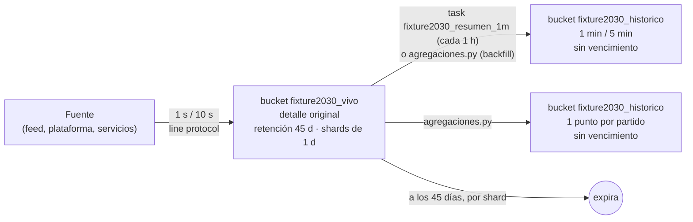

# Retención y granularidad — Hito 8 · Series temporales (InfluxDB 2)

**Ingeniería de Datos II · Grupo 2** — Santiago Pazos, Valentina Frisoli, Joaquín Núñez

> Responde la pregunta que el Hito 3 dejó abierta para N7: *¿qué política de retención y de reducción de resolución aplica?* (RF10, §5.5 del enunciado).

---

## 1. Ciclo de vida de una observación

| Etapa | Dónde | Granularidad | Cuánto dura | Para qué preguntas |
|---|---|---|---|---|
| Captura | bucket `fixture2030_vivo` | 1 s (feed y audiencia), 10 s (operación) | **45 días** | P1–P6 y P8: todo lo que se consulta en vivo o en la revisión del partido |
| Resumen por minuto | bucket `fixture2030_historico` | 1 min (feed y audiencia), 5 min (operación) | **Sin vencimiento** | Revisar la curva de un partido después de los 45 días |
| Resumen por partido | bucket `fixture2030_historico` | 1 punto por partido | **Sin vencimiento** | P7: rankings y comparaciones de todo el torneo |
| Prueba | bucket `fixture2030_prueba_retencion` | — | **1 hora** | Solo para demostrar que la expiración funciona (V5) |

## 2. Por qué 45 días de detalle original

- **Durante el torneo** el detalle por segundo es lo que consumen la app y la transmisión (P1, P2).
- **Después de cada partido** hace falta para la revisión: una jugada polémica, una caída del feed, un pico de audiencia que saturó un servicio. Eso se analiza en días, no en meses.
- Un Mundial de 2030 dura unas 5 semanas; 45 días cubren el torneo entero más unos 10 días de revisión del último partido.
- **Pasado ese plazo**, ninguna pregunta del negocio necesita el segundo exacto: la curva por minuto y los totales por partido responden todo lo que queda.

**Qué pregunta deja de poder responderse** cuando vence el detalle: "¿qué posesión tenía Argentina en el segundo 23 del minuto 40?". Se sigue pudiendo responder "¿y en el minuto 40?" (resumen por minuto) y "¿con cuánta posesión terminó?" (resumen por partido). Es una pérdida aceptada a propósito.

## 3. Cómo se resume cada medida (la función depende de la semántica)

| Medida | Naturaleza | Resumen por minuto | Resumen por partido | Lo que sería un error |
|---|---|---|---|---|
| `posesion_pct` | Gauge acumulado | `last()` | `last()` (posesión final) | `mean()`: mezcla los valores inestables de los primeros minutos |
| `pases_acum`, `tiros_acum`, `goles_acum` | Contador acumulado | `max()` | `max()` (total) | `sum()`: cuenta miles de veces los mismos pases |
| `recuperaciones` | Evento por segundo | `sum()` | `sum()` | `max()`: daría 1 |
| `usuarios_conectados` | Gauge | `max()` y `mean()` por región | **suma por segundo entre regiones, después `max()`** | Sumar los picos de cada región: da un total que nunca existió |
| `comentarios`, `sesiones_nuevas` | Evento por segundo | `sum()` | `sum()` | `mean()`: pierde el volumen |
| `latencia_p95_ms` | Percentil ya calculado | `max()` (en 5 min) | — | `mean()`: el promedio de percentiles no es un percentil y esconde los picos |
| `solicitudes`, `errores` | Evento por intervalo | `sum()` (en 5 min) | — | — |

`agregaciones.py` muestra el valor correcto y el incorrecto lado a lado (A1–A5), con los números reales de la carga.

## 4. Implementación del resumen: task nativa + backfill

InfluxDB 2 resume datos con **tasks**: scripts Flux que el servidor ejecuta solo, cada cierto tiempo, y que escriben el resultado con `to()`. El módulo usa **la misma lógica con dos disparadores**:

| Disparador | Cuándo | Qué rango procesa | Dónde |
|---|---|---|---|
| **Task `fixture2030_resumen_1m`** (producción) | Cada 1 hora, 5 minutos después de la hora | La última hora real (`range(start: -task.every)`) | La registra `agregaciones.py` en el servidor (estado activo) |
| **`agregaciones.py`** (carga histórica) | A mano, después de la carga | Cada partido y cada día del torneo, acotado | El laboratorio: los datos están fechados en 2030, así que una task basada en "la última hora real" no los encuentra |

**Reemplazo explícito (idempotencia).** Antes de escribir los resúmenes de un partido, el script **borra ese tramo** del bucket histórico con `POST /api/v2/delete` y recién después escribe con `to()`. En la prueba real, una segunda corrida del resumen después de reiniciar el servidor dejó **un punto duplicado** en `resumen_partido_audiencia`: misma serie y mismo timestamp, pero guardado dos veces. La V8 lo detectó (el total de comentarios del histórico no coincidía con el del vivo). Con el reemplazo explícito, el resultado ya no depende de que el servidor unifique dos escrituras del mismo punto: se corrió dos veces seguidas, con un reinicio en el medio, y la V8 dio ✅.

**Tiempo del backfill medido:** 112 partidos en **378 s** (~3,4 s por partido: 4 borrados y 3 consultas Flux con 18 escrituras de resumen).

## 5. Efecto de la política sobre consultas, almacenamiento y costo

| | Bucket vivo (1 s) | Bucket histórico |
|---|---|---|
| Puntos del torneo completo | 10.094.400 | 185.616 (detalle abajo) |
| Espacio en disco medido (V7) | 35,0 MB en 25 shards | 6,5 MB en 5 shards |
| Consultas en vivo | Las responde (P1–P6, P8) | No aplica |
| Consultas de torneo | Posibles, pero recorren 25 shards y 7,8 M de puntos de audiencia | Las responden 112 puntos (P7). V8: mismo resultado en los dos buckets |
| Almacenamiento | Se libera a los 45 días, un shard (un día) por vez | Crece solo con la cantidad de partidos |

Detalle del bucket histórico para el torneo completo (**calculado antes de la prueba y medido después: coinciden**):

| Measurement | Cálculo | Puntos (calculado = medido) |
|---|---|---:|
| `estadisticas_equipo_1m` | 112 partidos × 2 equipos × 95 minutos jugados | 21.280 |
| `audiencia_partido_1m` | 112 partidos × 8 regiones × 145 minutos | 129.920 |
| `operacion_plataforma_5m` | 5 servicios × 6.816 tramos de 5 min (568 h) | 34.080 |
| `resumen_partido_equipo` | 112 × 2 | 224 |
| `resumen_partido_audiencia` | 112 | 112 |
| **Total** | | **185.616** |

El bucket histórico tiene **≈ 54 veces menos puntos** que el vivo (10.094.400 / 185.616) y conserva las respuestas a todas las preguntas que siguen teniendo valor después del torneo.

## 6. Cómo se verifica

| Verificación | Dónde | Resultado |
|---|---|---|
| Retención configurada en cada bucket (45 d / infinita / 1 h) | `validacion.py` V4, API `/api/v2/buckets` | ✅ |
| La retención se aplica: un punto de hace 2 h no entra al bucket de 1 h | `validacion.py` V5 | ✅ — el servidor lo **rechazó al escribir** (HTTP 422, *"dropped 1 points outside retention policy of duration 1h0m0s"*) |
| Resúmenes escritos, idempotentes, y la pregunta de torneo da igual en los dos buckets | `agregaciones.py` + `validacion.py` V8 | ✅ |

**Límite del laboratorio:** el torneo está fechado en 2030, así que en el bucket vivo ningún punto vence durante la prueba (la retención se calcula contra la hora actual). Por eso existe el bucket de prueba de 1 hora: demuestra el mecanismo real con puntos fechados hoy. En InfluxDB 2 la retención actúa de dos maneras: **rechaza** al escribir los puntos que ya nacen fuera del período, y **borra shards enteros** cuando su fin queda más atrás que el período (el chequeo corre cada 30 minutos).
