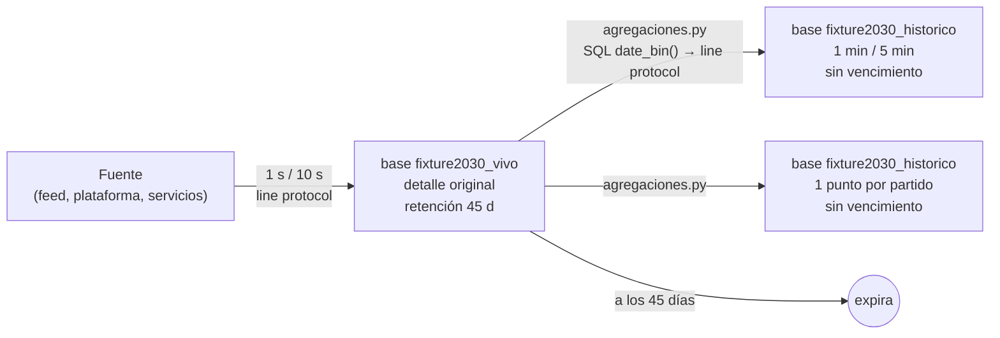

# Retención y granularidad — Hito 8 · Series temporales (InfluxDB 3 Core)

**Ingeniería de Datos II · Grupo 2** — Santiago Pazos, Valentina Frisoli, Joaquín Núñez

> Responde la pregunta que el Hito 3 dejó abierta para N7: *¿qué política de retención y de reducción de resolución aplica?* (RF10, §5.5 del enunciado).

---

## 1. Ciclo de vida de una observación

| Etapa | Dónde | Granularidad | Cuánto dura | Para qué preguntas |
|---|---|---|---|---|
| Captura | base `fixture2030_vivo` | 1 s (feed y audiencia), 10 s (operación) | **45 días** | P1–P6 y P8: todo lo que se consulta en vivo o en la revisión del partido |
| Resumen por minuto | base `fixture2030_historico` | 1 min (feed y audiencia), 5 min (operación) | **Sin vencimiento** | Revisar la curva de un partido después de los 45 días |
| Resumen por partido | base `fixture2030_historico` | 1 punto por partido | **Sin vencimiento** | P7: rankings y comparaciones de todo el torneo |
| Prueba | base `fixture2030_prueba_retencion` | — | **1 hora** | Solo para demostrar que la expiración funciona (V5) |

En InfluxDB 3 Core **la retención se define al crear cada base y no se puede cambiar después** (`influxdb3 create database --retention-period 45d`). Por eso cada política es una base distinta, y `inicializacion.sh` las crea antes de cargar cualquier dato.

## 2. Por qué 45 días de detalle original

- **Durante el torneo** el detalle por segundo es lo que consumen la app y la transmisión (P1, P2).
- **Después de cada partido** hace falta para la revisión: una jugada polémica, una caída del feed, un pico de audiencia que saturó un servicio. Eso se analiza en días, no en meses.
- Un Mundial de 2030 dura unas 5 semanas; 45 días cubren el torneo entero más unos 10 días de revisión del último partido.
- **Pasado ese plazo**, ninguna pregunta del negocio necesita el segundo exacto: la curva por minuto y los totales por partido responden todo lo que queda.

**Qué pregunta deja de poder responderse** cuando vence el detalle: "¿qué posesión tenía Argentina en el segundo 23 del minuto 40?". Se sigue pudiendo responder "¿y en el minuto 40?" (resumen por minuto) y "¿con cuánta posesión terminó?" (resumen por partido). Es una pérdida aceptada a propósito.

Como la retención es inmutable en Core, elegir 45 días es una decisión que se toma **antes** del torneo: si después hiciera falta más tiempo, habría que crear otra base y copiar los datos.

## 3. Cómo se resume cada medida (la función depende de la semántica)

| Medida | Naturaleza | Resumen por minuto | Resumen por partido | Lo que sería un error |
|---|---|---|---|---|
| `posesion_pct` | Gauge acumulado | `last_value(… ORDER BY time)` | `last_value()` (posesión final) | `avg()`: mezcla los valores inestables de los primeros minutos |
| `pases_acum`, `tiros_acum`, `goles_acum` | Contador acumulado | `max()` | `max()` (total) | `sum()`: cuenta miles de veces los mismos pases |
| `recuperaciones` | Evento por segundo | `sum()` | `sum()` | `max()`: daría 1 |
| `usuarios_conectados` | Gauge | `max()` y `avg()` por región | **suma por segundo entre regiones, después `max()`** | Sumar los picos de cada región: da un total que nunca existió |
| `comentarios`, `sesiones_nuevas` | Evento por segundo | `sum()` | `sum()` | `avg()`: pierde el volumen |
| `latencia_p95_ms` | Percentil ya calculado | `max()` (en 5 min) | — | `avg()`: el promedio de percentiles no es un percentil y esconde los picos |
| `solicitudes`, `errores` | Evento por intervalo | `sum()` (en 5 min) | — | — |

`agregaciones.py` muestra el valor correcto y el incorrecto lado a lado (A1–A5), con los números reales de la carga.

## 4. Implementación del resumen: SQL + line protocol

El SQL de InfluxDB 3 es de **solo lectura** (no existe `INSERT … SELECT`). Por eso `agregaciones.py` resume cada partido en dos pasos:

1. **Calcular** con una consulta SQL sobre `fixture2030_vivo`, acotada al partido: `date_bin(INTERVAL '1 minute', time)` + `GROUP BY` y la función de cada medida (tabla del §3).
2. **Escribir** el resultado como line protocol en `fixture2030_historico` (`POST /api/v3/write_lp`), con los tipos explícitos de cada field (entero con `i`, real con punto decimal).

Lo mismo para la operación, por día, en ventanas de 5 minutos. En el laboratorio se ejecuta una vez después de la carga, porque los datos están fechados en 2030. En operación real correría al cierre de cada partido. En InfluxDB 3 Core eso se programa con un disparador del *Processing Engine*, que queda fuera del alcance del hito.

**Idempotencia.** Cada resumen tiene la misma serie (tabla + tags) y el mismo timestamp en cada corrida, y InfluxDB 3 deduplica por clave de serie + `time`: la segunda escritura reemplaza a la primera. Se verificó en la prueba real: el resumen del perfil completo se corrió **dos veces, con un reinicio del servidor en el medio**, y los conteos del histórico (185.616 puntos) y la V8 dieron igual. (En la versión anterior del módulo, sobre InfluxDB 2, la misma prueba había dejado un punto duplicado y hacía falta borrar el tramo antes de reescribirlo. En InfluxDB 3 no hace falta.)

**Tiempo medido:** 112 partidos en **136,9 s** (~1,2 s por partido: 4 consultas SQL y una escritura de unas 1.350 líneas).

## 5. Efecto de la política sobre consultas, almacenamiento y costo

| | Base viva (1 s) | Base histórica |
|---|---|---|
| Puntos del torneo completo | 10.094.400 | 185.616 (detalle abajo) |
| Consultas en vivo | Las responde (P1–P6, P8), en 8–22 ms | No aplica |
| Consultas de torneo | Posibles, pero recorren 7,8 M de puntos de audiencia: **4.309 ms** (V8) | Las responden 112 puntos: **41 ms** (V8), mismo resultado |
| Almacenamiento | Se libera a los 45 días | Crece solo con la cantidad de partidos |

Detalle de la base histórica para el torneo completo (**calculado antes de la prueba y medido después: coinciden**):

| Tabla | Cálculo | Puntos (calculado = medido) |
|---|---|---:|
| `estadisticas_equipo_1m` | 112 partidos × 2 equipos × 95 minutos jugados | 21.280 |
| `audiencia_partido_1m` | 112 partidos × 8 regiones × 145 minutos | 129.920 |
| `operacion_plataforma_5m` | 5 servicios × 6.816 tramos de 5 min (568 h) | 34.080 |
| `resumen_partido_equipo` | 112 × 2 | 224 |
| `resumen_partido_audiencia` | 112 | 112 |
| **Total** | | **185.616** |

La base histórica tiene **≈ 54 veces menos puntos** que la viva (10.094.400 / 185.616) y conserva las respuestas a todas las preguntas que siguen teniendo valor después del torneo.

## 6. Cómo se verifica

| Verificación | Dónde | Resultado |
|---|---|---|
| Retención configurada en cada base (45 d / infinita / 1 h) | `validacion.py` V4, `system.databases`; también `influxdb3 show retention` en `01_inicializacion.txt` | ✅ |
| La retención se aplica: un punto de hace 2 h no queda en la base de 1 h | `validacion.py` V5 | ✅. El servidor **aceptó la escritura (HTTP 204) y no conservó el punto**: no aparece en la consulta |
| Resúmenes escritos, idempotentes, y la pregunta de torneo da igual en las dos bases | `agregaciones.py` + `validacion.py` V8 | ✅ |

**Límite del laboratorio:** el torneo está fechado en 2030, así que en la base viva ningún punto vence durante la prueba (la retención se calcula contra la hora actual). Por eso existe la base de prueba de 1 hora: demuestra el mecanismo real con puntos fechados hoy. En InfluxDB 3 Core la retención actúa de dos maneras. **No conserva** los puntos que ya nacen fuera del período, y no avisa con un error, a diferencia de la versión 2, que respondía 422. Además, **borra los datos vencidos** con un chequeo periódico (`--retention-check-interval`, 30 minutos por defecto).
