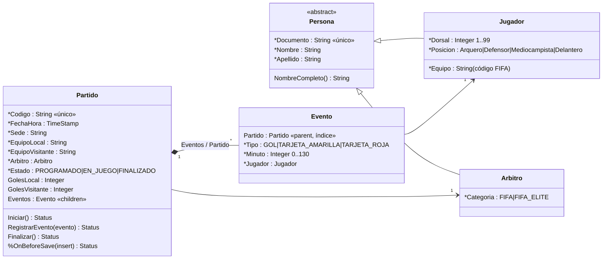

# Fixture 2030 — Hito 9 · Entidades complejas (InterSystems IRIS)

**Repositorio:** https://github.com/Joaconz/fixture_2030_ing_datos_II
**Ingeniería de Datos II · Grupo 2** — Santiago Pazos, Valentina Frisoli, Joaquín Núñez

Porción del dominio del Fixture 2030 como clases persistentes de IRIS: un **Partido** con su lista subordinada de **Eventos** (goles y tarjetas), su **Árbitro** y los **Jugadores** de los eventos. Jugador y Árbitro heredan de **Persona**.

- Partido es el módulo N2 del TPO: en el Hito 2 se asignó a IRIS y en el Hito 3 se le exigió consistencia fuerte.
- Los códigos de partido y de sede son los mismos de los Hitos 5 a 8. Los jugadores son los del Hito 4 (mismo dni y equipo), exportados de MongoDB a `data/jugadores.csv`.
- **Limitación conocida (Hallazgo H1, [`../docs/ESTADO-CANONICO-NECESIDADES.md`](../docs/ESTADO-CANONICO-NECESIDADES.md)):** como los equipos salen del roster de MongoDB, los **equipos de cada partido no coinciden** con los del calendario del grafo (Hito 5), que es el que usan también Cassandra, Redis e InfluxDB. Por ejemplo, `PAR-A-1` es ARG–BRA acá y ARG–NED en los Hitos 5 a 8, y Uruguay es `URY` acá y `URU` allá. Coinciden el código, la fecha, la sede y la plantilla de goles; se va a unificar junto con la identidad de jugadores entre MongoDB y Neo4j.
- Versión observada de `intersystems/iris-community:latest-cd`: IRIS 2026.2 (Build 221U), 06/10/2026.

---

## 1. Diagrama de objetos

`*` = propiedad `[ Required ]`.



| Elemento | Requisito |
|---|---|
| `Persona` (abstracta, persistente) → `Jugador`, `Arbitro` | RF4. Comparten extent: en SQL, `Fixture.Persona` trae a los dos |
| `Partido.Eventos` ↔ `Evento.Partido` (`Cardinality = children / parent`) | RF3. Bidireccional desde el modelo: asignar `evento.Partido` lo agrega a `partido.Eventos` |
| `Index PartidoIdx On Partido` en `Evento` | RNF3: índice en el lado "muchos" de la relación |
| `[ Required ]`, `MINVAL`/`MAXVAL`, `VALUELIST`, `PATTERN`, `MAXLEN` | RF5 |
| `Partido.RegistrarEvento()` | RF9: sólo con el partido EN_JUEGO y con minuto entre 1 y 130 (rechaza, por ejemplo, un evento en el minuto 0 de un partido FINALIZADO) |
| `Partido.Iniciar()` / `Finalizar()` | Transiciones PROGRAMADO → EN_JUEGO → FINALIZADO. `Finalizar()` calcula el resultado contando los goles |
| `Partido.%OnBeforeSave()` | §5.2: valida el objeto entero antes de guardar (dos equipos distintos; un partido FINALIZADO en la base no se modifica) |

## 2. Matriz de integridad

| Situación | Qué hace la base | Mecanismo |
|---|---|---|
| **Se borra un partido** | **Sus eventos se borran con él.** Los jugadores y el árbitro no se borran | Relación padre-hijo: el evento no existe sin su partido |
| Se guarda un partido con eventos nuevos | Un solo `partido.%Save()` guarda el partido y sus eventos, en una transacción | Relación padre-hijo |
| Falta una propiedad obligatoria (por ejemplo, la sede) | El `%Save()` se rechaza y no se guarda nada | `[ Required ]` |
| Un valor fuera de tipo (dorsal 150, tipo de evento inexistente) | El `%Save()` se rechaza | `MAXVAL`, `VALUELIST`, `PATTERN` |
| Un evento en un partido que no está EN_JUEGO, o en el minuto 0 | `RegistrarEvento()` lo rechaza y el partido queda igual | Método de la clase `Partido` |
| Un evento de un jugador que no es de ninguno de los dos equipos | `RegistrarEvento()` lo rechaza | Método de la clase `Partido` |
| Iniciar o finalizar fuera de orden | `Iniciar()` / `Finalizar()` lo rechazan | Métodos de la clase `Partido` |
| Modificar un partido FINALIZADO (por ejemplo, volverlo a EN_JUEGO a mano) | El `%Save()` se rechaza | `Partido.%OnBeforeSave()` |
| Dos personas con el mismo documento | Se rechaza | Índice único `DocumentoIdx` |

## 3. Código fuente

```
fixture2030-iris/
├── docker-compose.yml        intersystems/iris-community:latest-cd, Durable %SYS en ~/docker/data/iris
├── .gitignore                no se versionan archivos de la base
├── src/Fixture/
│   ├── Persona.cls           clase base abstracta (RF4)
│   ├── Jugador.cls           hereda de Persona
│   ├── Arbitro.cls           hereda de Persona
│   ├── Partido.cls           padre de la relación, estados y validaciones (RF3, RF9)
│   ├── Evento.cls            hijo de la relación (RF3, RNF3)
│   ├── Carga.cls             script de carga (RF6)
│   └── Demo.cls              demostración de la §5.3 (RF7, RF8, RF9)
├── data/jugadores.csv        jugadores del Hito 4 (exportados de MongoDB)
├── scripts/                  inicialización, compilación, carga, demo y exportación desde MongoDB
└── docs/evidencia/           salidas de la terminal de IRIS
```

## 4. Operativa

Requisitos: Docker Desktop (o Docker Engine) con Compose V2 y una terminal bash (en Windows, Git Bash). En Linux, después de crear la carpeta, darle permisos al usuario del contenedor: `sudo chown 51773:51773 ~/docker/data/iris`.

Todos los comandos se ejecutan desde esta carpeta:

```bash
bash scripts/inicializacion.sh   # crea ~/docker/data/iris, docker compose up -d, carga y compila las clases
bash scripts/carga.sh            # do ##class(Fixture.Carga).Ejecutar()
bash scripts/demo.sh             # do ##class(Fixture.Demo).Todo()
```

### 4.1 Paso a paso en la terminal de IRIS

Abrir la terminal:

```bash
docker compose exec iris iris session IRIS -U USER
```

Cargar y compilar las clases, cargar los datos y correr la demostración:

```objectscript
do $SYSTEM.OBJ.LoadDir("/home/irisowner/fixture/src", "ck", , 1)
do ##class(Fixture.Carga).Ejecutar()
do ##class(Fixture.Demo).Todo()
```

Instanciar y navegar objetos a mano:

```objectscript
set p = ##class(Fixture.Partido).CodigoIdxOpen("PAR-A-3")
write p.EquipoLocal, " ", p.GolesLocal, "-", p.GolesVisitante, " ", p.EquipoVisitante, " · árbitro: ", p.Arbitro.NombreCompleto(), !
set k = "" for { set e = p.Eventos.GetNext(.k) quit:k=""  write e.Minuto, "' ", e.Tipo, " ", e.Jugador.NombreCompleto(), ! }
```

Las mismas entidades por SQL (`do $SYSTEM.SQL.Shell()` en la terminal, o el Management Portal en http://localhost:52773/csp/sys/UtilHome.csp):

```sql
SELECT Codigo, EquipoLocal, GolesLocal, GolesVisitante, EquipoVisitante, Estado, Arbitro->Apellido FROM Fixture.Partido
SELECT Partido->Codigo, Minuto, Tipo, Jugador->Apellido FROM Fixture.Evento
```

### 4.2 Detener y reiniciar sin perder datos

```bash
docker compose down     # los datos y las clases quedan en ~/docker/data/iris
docker compose up -d
```

### 4.3 Datos del Hito 4

`data/jugadores.csv` ya está en el repositorio. Si cambian los jugadores del Hito 4, con el MongoDB de `../fixture2030-mongodb` levantado y cargado: `bash scripts/exportar_desde_mongo.sh`.

## 5. Evidencia de ejecución

| Archivo | Qué muestra |
|---|---|
| [`docs/evidencia/01_inicializacion.txt`](./docs/evidencia/01_inicializacion.txt) | Versión de la imagen, Durable %SYS en `~/docker/data/iris` y las clases compiladas sin errores (RF1, RNF1, RNF2) |
| [`docs/evidencia/02_carga.txt`](./docs/evidencia/02_carga.txt) | Carga: 1.472 jugadores, 4 árbitros y 6 partidos, cada uno guardado con sus eventos en un único `%Save()` (RF6) |
| [`docs/evidencia/03_demo.txt`](./docs/evidencia/03_demo.txt) | §5.3: padre e hijo con un solo `%Save()`; fallo controlado por la sede omitida; navegación sin SQL (RF7); el evento en el minuto 0 de un partido FINALIZADO rechazado (RF9); las mismas entidades por SQL, incluido un `UPDATE` (RF8); y la cascada al borrar el partido de prueba |
